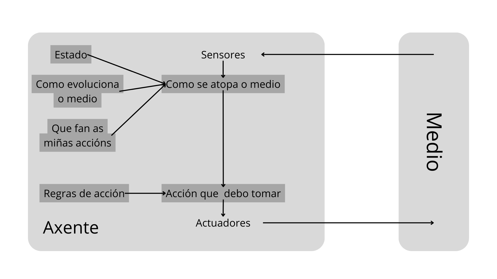

# Axente Intelixente para RPS

### O problema

Estudo da solución básica ao xogo **pedra, papel, tesoiras** a través dun axente intelixente programado en Python

### Contorno de tarefas

| Contorno de tarefas |  Observable  | Axentes | Determinista | Episódico | Estático | Discreto | Coñecido |
| :-----------------: | :----------: | :-----: | :----------: | :--------: | :-------: | :------: | :-------: |
|         RPS         | Parcialmente |  Multi  | Estocástico | Episódico | Estático | Discreto | Coñecido |

* **Parcialmente Observable:** Xa que non podemos saber o que "pensa" o axente ao que se enfrenta o noso.
* **Multiaxente:** Existen dous xogadores(axentes) que se enfrentan.
* **Estocástico:** As accións do axente non sempre levan ao mesmo resultado.
* **Episódico:** Cada partida dase nun instante.
* **Estático:** O medio non cambia mentras o axente está a pensar a súa acción.
* **Discreto:** As posibles variables que se poden dar son limitadas e ademáis tamén estas son discretas.
* **Coñecido:** Sabemos as reglas do xogo e como aplicalas.

### Estrutura do Axente

Optei por un axente reactivo baseado en modelos. O meu axente toma o historial de partidas xogadas, a partir de este colle a última partida xogada e busca a partida seguinte a todas as similares a esta. De este conxunto tomamos o movemento máis probable do rival e realizamos o movemento gañador contra este.

### Implementación

A implentación de este axente está realizada en [Python 3.12](https://www.python.org/downloads/release/python-3120/) apoiandose na librería [Pandas](https://pandas.pydata.org/) e no código aportado por [dfleta](https://github.com/dfleta) no seu repositorio de [RPS](https://github.com/dfleta/pedra-papel-tesoira) (lixeiramente modificado para adaptarse as nosas necesidades). Todo o meu código atópase no [repositorio do proxecto](https://github.com/TH0RlN/RPS_Mia).

### Extensión - Pedra Papel Tesoiras Lagarto Spock (RPSLS)

Engadiuse un diccionario extra, baseado no orixinal, que permite o uso do axente na versión extendida do xogo (RPSLS). A estructura do axente non precisa modificación para poder funcionar con esta versión extendida, mais precisa máis partidas para comenzar a ser efectivo ao ter máis posibilidades entre as que elixir.
